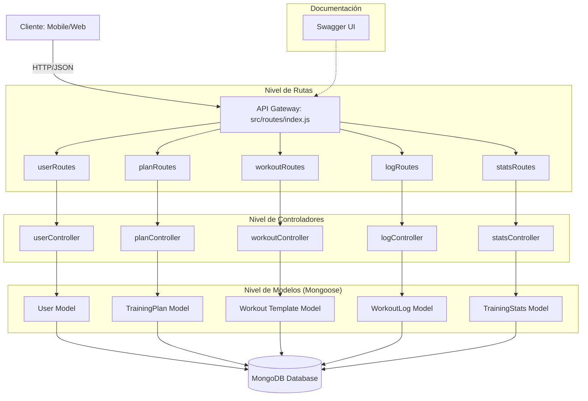

# Arquitectura del Sistema

El backend sigue un patrón MVC adaptado para una API RESTful con Node.js y Express.

```mermaid
graph TD
    Client[Cliente: Mobile/Web] -->|HTTP/JSON| API[API Gateway: src/routes/index.js]
    
    subgraph "Nivel de Rutas"
        API --> UR[userRoutes]
        API --> PR[planRoutes]
        API --> WR[workoutRoutes]
        API --> LR[logRoutes]
        API --> SR[statsRoutes]
    end

    subgraph "Nivel de Controladores"
        UR --> UC[userController]
        PR --> PC[planController]
        WR --> WC[workoutController]
        LR --> LC[logController]
        SR --> SC[statsController]
    end

    subgraph "Nivel de Modelos (Mongoose)"
        UC --> UM[User Model]
        PC --> TPM[TrainingPlan Model]
        WC --> WM[Workout Template Model]
        LC --> WLM[WorkoutLog Model]
        SC --> SM[TrainingStats Model]
    end

    UM & TPM & WM & WLM & SM --> DB[(MongoDB Database)]
    
    subgraph "Documentación"
        SW[Swagger UI] -.-> API
    end
```
