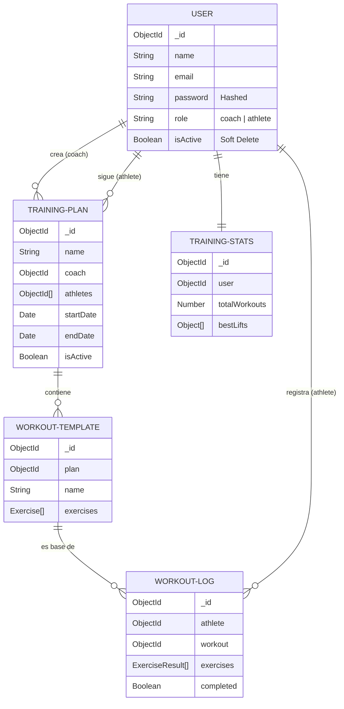

# Modelo de Datos (ERD)

Relaciones entre las entidades principales del sistema de entrenamiento.

```mermaid
erDiagram
    USER ||--o{ TRAINING-PLAN : "crea (coach)"
    USER ||--o{ TRAINING-PLAN : "sigue (athlete)"
    USER ||--|| TRAINING-STATS : "tiene"
    
    TRAINING-PLAN ||--o{ WORKOUT-TEMPLATE : "contiene"
    
    WORKOUT-TEMPLATE ||--o{ WORKOUT-LOG : "es base de"
    USER ||--o{ WORKOUT-LOG : "registra (athlete)"
    
    USER {
        ObjectId _id
        String name
        String email
        String password "Hashed"
        String role "coach | athlete"
        Boolean isActive "Soft Delete"
    }

    TRAINING-PLAN {
        ObjectId _id
        String name
        ObjectId coach
        ObjectId[] athletes
        Date startDate
        Date endDate
        Boolean isActive
    }

    WORKOUT-TEMPLATE {
        ObjectId _id
        ObjectId plan
        String name
        Exercise[] exercises
    }

    WORKOUT-LOG {
        ObjectId _id
        ObjectId athlete
        ObjectId workout
        ExerciseResult[] exercises
        Boolean completed
    }

    TRAINING-STATS {
        ObjectId _id
        ObjectId user
        Number totalWorkouts
        Object[] bestLifts
    }
```
