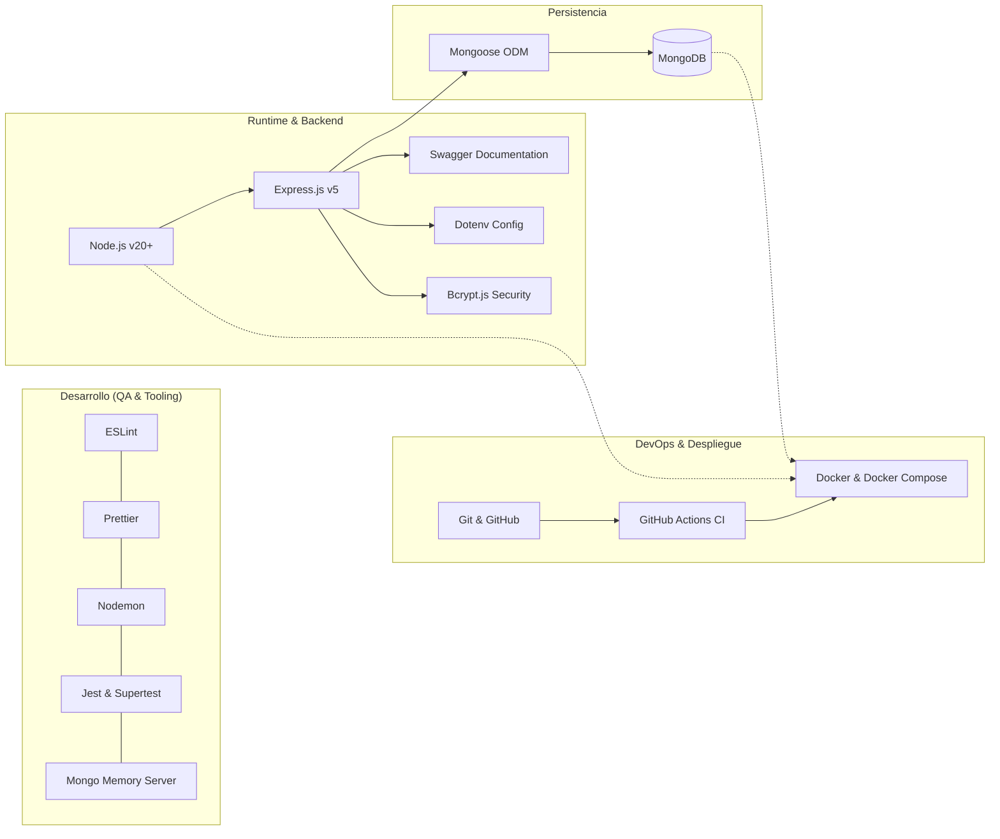

# Stack Tecnológico Global

Mapa de las tecnologías y herramientas utilizadas en el ciclo de vida del proyecto.

```mermaid
graph LR
    subgraph "Desarrollo (QA & Tooling)"
        ES[ESLint] --- PT[Prettier]
        PT --- ND[Nodemon]
        ND --- JS[Jest & Supertest]
        JS --- MMS[Mongo Memory Server]
    end

    subgraph "Runtime & Backend"
        Node[Node.js v20+] --> EX[Express.js v5]
        EX --> SW[Swagger Documentation]
        EX --> ENV[Dotenv Config]
        EX --> BC[Bcrypt.js Security]
    end

    subgraph "Persistencia"
        EX --> MG[Mongoose ODM]
        MG --> MDB[(MongoDB)]
    end

    subgraph "DevOps & Despliegue"
        Git[Git & GitHub] --> GHA[GitHub Actions CI]
        GHA --> DK[Docker & Docker Compose]
    end

    Node -.-> DK
    MDB -.-> DK
```
